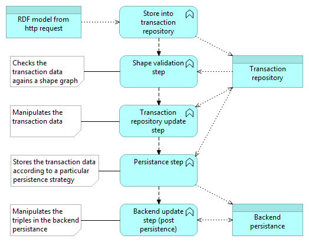
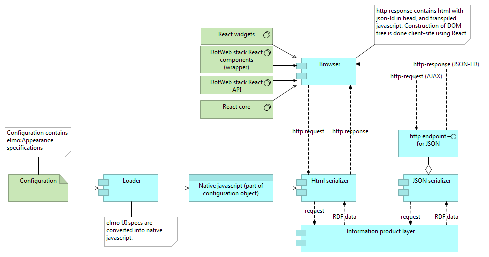

# Design

This folder contains the overall design of the DotWebStack / Linked Data Theatre. Only overall design considerations are supposed to be stored at this place. Technical design considerations that are local to a particular project, should be part of the code or separate docs folder in that project.

The global design is created using archi, an open source editor for Archimate diagrams. This readme contains snapshots from those files, so somebody without archi can read the diagrams.

## Diagrams

### Transaction flow

### Front-end architecture

