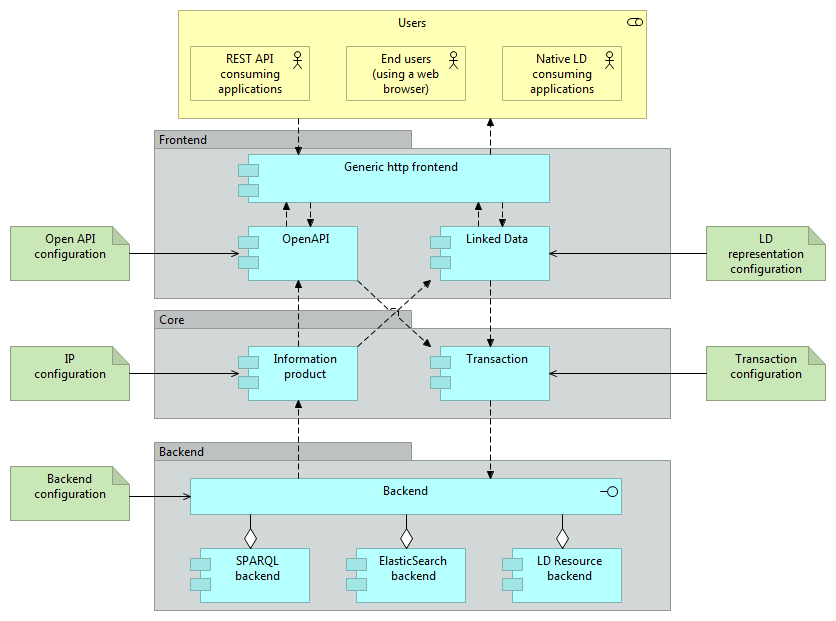

# Design

This folder contains the overall design of the DotWebStack / Linked Data Theatre. Only overall design considerations are supposed to be stored at this place. Technical design considerations that are local to a particular project, should be part of the code or separate docs folder in that project.

The global design is created using archi, an open source editor for Archimate diagrams. This readme contains snapshots from those files, so somebody without archi can read the diagrams.

## Top-level architecture

The DotWebStack framework has a three-layer architecture:

- The frontend layer deals with all concerns that translates a web request to a corresponding request to the core layer. It deals with translating a certain protocol to the generic internal interface of the core layer. At this moment an OpenAPI frontend and a native Linked Data frontend are provided. Any frontend may be added, even a ftp or http SOAP webservices frontend.
- The core layer deals with all concerns that translate a request for an information product or a request to execute a transaction to the individual requests to a specific backend.
- The backend layer deals with all concerns that translate a request from the core layer to a backend-specific request. At this moment a File-based read-only backend and a SPARQL backend have been implemented. Other backends may include document stores (like elastic search) or native linked data resources (as available on a website).

All components of the DotWebStack framework are configurable. The configuration specifies the actual behaviour of these components. The configuration is specified using linked data trig files, except for the OpenAPI configuration which is specified using a yaml file according to the OpenAPISpecification standard.

### Frontend layer
The frontend layer contains a generic http frontend. All http requests are handled by this generic frontend. Specific frontends can register multiple URI paths such that handling these URI paths are dispatched to the corresponding specific frontend. No overlapping should occur between registered URI paths (only one specific frontend can handle any single request).

Two frontends are available at this moment:

- An OpenAPI Frontend, delivering JSON REST API's that conform to the configuration as stated using the OpenAPI specification;
- A Linked data frontend, delivering Linked Data in various Linked Data serializations (JSON-LD, Turtle, XML/RDF, and also HTML).

### Core layer
The core layer contains two components:

- The information product factory, that delivers linked data resources, packaged as RDF4j models (zero or more sets of triples, the result of a CONSTRUCT statement) or RDF4j binding sets (the result of a SELECT statement);
- The transaction factory, that executes transactions, including the storage of new data and the transformation of non-linked data to linked data.

### Backend layer
The backend layer deals with the actual retrieval and storage of linked data. Specific types of backend may be registered within the framework. All backend should implement the backend interface, which means that they can produce and consume linked data resources.

At this moment, only a SPARQL backend is available.

## More information

Detailed information can be found at:

- [Information products](information-products.md);
- [Transactions](transactions.md);
- [Linked data frontend](ldfrontend.md).
