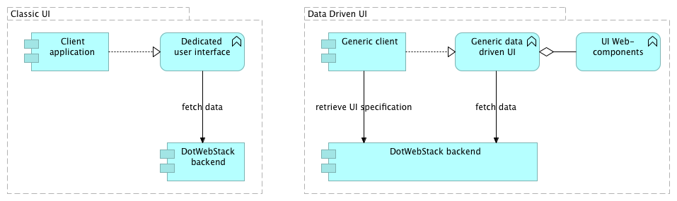

# Data Driven UI Design

## Introduction
The DotWebStack framework promotes the use of a data driven design approach to the user interface. Instead of creating a user interface and trying to "push" the data into this predefined user interface, we let the data drive the way it is presented to the user.

The obvious advantage of this approach is that changes to the data are automatically presented to the user, without the need to reprogram the user interface.

Another advantage is the separation of the technical value of user experience and the business value of information: user interface programmers can dedicate their time to create beautiful and user-friendly webcomponents, and information engineers can dedicate their time to specifiy the information that should be presented to the end user.

The disadvantage is the change of focus: instead of the user interface being the centre of the world, the data itself becomes the centre of the world. For those situations that a the user interface should be the centre, a more classical approach can be taken, in which a specific application "pulls" the data from a (linked data) API.



## Specifying the data driven user interface
To specify a data driven user interface, we first have to specify what kind of data we want to present to the user. We need to specify the "shape" of the data that is presented to the user. Any data that conforms to this particular shape is presented to the end user, according to the UI-annotations that are annotated to that particular shape.

To specify these shapes, we will use the Shape Constraint Language ([SHACL](https://www.w3.org/TR/shacl)). The use case for which SHACL is mostly known, is the ability to validate data against a particular shape. It may however also be used to drive user interfaces, as stated in the introduction of the specification:

*SHACL shape graphs are used to validate that data graphs satisfy a set of conditions they can also be viewed as a description of the data graphs that do satisfy these conditions. Such descriptions may be used for a variety of purposes beside validation, including user interface building, code generation and data integration.*

An example how shacl could be used to drive user interfaces is actuallly [included in the specification](https://www.w3.org/TR/shacl/#defaultValue).

Let's have a look at the following example-data:

```
ex:John a foaf:Person;
  foaf:firstName "John";
  foaf:surName "Doe"
.
```

We would like to create some user-interface for this particular data. The shape that matches the data looks like:

```
ex:PersonShape a sh:NodeShape;
  sh:property [
    sh:path foaf:firstName;
  ];
  sh:property [
    sh:path foaf:surName;
  ]
.
```

Now, let's annotate the shape. For example: we want to display the firstname before the surname, and we might include some labels:

```
ex:PersonShape a sh:NodeShape;
  sh:property [
    sh:order 1;
    sh:path foaf:firstName;
    rdfs:label "First name"@en;
    rdfs:label "Voornaam"@nl;
  ];
  sh:property [
    sh:order 2;
    sh:path foaf:surname;
    rdfs:label "Surname"@en;
    rdfs:label "Achternaam"@nl;
  ]
.
```

Webcomponents may specify their own properties that can be used to annotate specific UI behaviour. For example, the webcomponent we want to use might have the option to depict a specific resource as an image, for example, the following data:

```
ex:John foaf:depiction <http://wikipedia/JohnDoe.png>.
```

Might be shaped according to:

```
  sh:property [
    sh:order 3;
    sh:path foaf:depiction;
    xhtml:role xhtml:img
  ]
```
The `xhtml:role` annotation states that the particular shape should be presentated as a `xhtml:img`: an image.

## Shaping tuple results
The example above used graph result (triples, the result of a CONSTRUCT query) as data to be shaped into a user interface. In some cases, a tuple result (bindingsets, the result of a SELECT query) might be more appropriate. Shacl doesn't formally include a way to target bindingsets, but a natural way is provided by the ability to specify a `sh:name` for a particular property shape.

This means that the result of the following query can also be 'shaped' (using the same data as in the previous example):

```
SELECT ?person ?firstname ?surname
WHERE {
  ?person a foaf:Person;
          foaf:firstName ?firstname;
          foaf:surname ?surname
  .
}
```

The shape (including UI annotations) might look like:

```
ex:PersonTableShape a sh:NodeShape;
  sh:property [
    sh:name "person";
    xhtml:role xhtml:link;
    sh:group ex:PersonFragment
  ];
  sh:property [
    sh:name "firstname";
    sh:group ex:PersonFragment
  ];
  sh:property [
    sh:name "surname";
    sh:order 2;
    rdfs:label "Surname"@en;
  ]
.
ex:PersonFragment a sh:PropertyGroup;
  sh:order 1;
  rdfs:label "First name"@en;
.
```

The values of `sh:name` link a particular propertyshape to the variable name from the SELECT query. This example introduces two new elements:

1. The `xhtml:link` role. This role states that the value should be presented as a html link;
2. The `sh:group` element. This element groups properties that should be presented as a whole. In this particular example, the link and the actual value is grouped, creating a html link with a label from the property `foaf:firstName`.

The actual user interface might look like:

|First name|Surname|
|----------|-------|
|[John](http://example.org/John)|Doe|

## Representation and appearances
The elmo vocabulary, the specification language for the DotWebStack, includes the notion of *representations* and *appearances*.

A representation is the specification how a particular http request should be represented. It combines the specification of the information product that is represented, and the appearance by which it is represented.

For example: the URI `http://example.org/all-friends-of?subject=JohnDoe` might result in a webpage containing a table with all friends of John Doe. The information product will produce a tuple result with all friends of John Doe. The appearance specification will specify the way this tuple result is presented. For example: within a table, with paging, column sorting and a filter field:

```
prefix dwsapp: <http://dotwebstack.org/appearance>
prefic dwsopt: <http://dotwebstack.org/appearance/option>

ex:FriendsEndpoint a elmo:Endpoint;
  elmo:pathPattern "/all-friends-of";
  elmo:getRepresentation ex:FriendsRepresentation;
.
ex:FriendsRepresentation a elmo:Representation;
  elmo:appearance ex:FriendsAppearance;
  elmo:informationProduct ex:FriendsData
.
ex:FriendsAppearance a dwsapp:TupleList;
  elmo:options dwsopt:Paging, dwsopt:Sorting, dwsopt:Filter;
  elmo:shape [
    elmo:property [
      sh:name "friend";
      sh:group ex:FriendFragment;
      xhtml:role xhtml:link
    ];
    elmo:property [
      sh:name "friend_label";
      sh:group ex:FriendFragment
    ]
  ]
.
ex:FriendFragment a sh:PropertyGroup.
```

The type of this appearance (`dwsapp:TupleList`) refers to the webcomponent with the same name in the dotwebstack namespace that will render the data. The properties of this appearance are used as configuration options for the webcomponent.

## Page versus representation
The mental model of an end user might differ from the way information products are specified. In a strict Linked Data ideal world, every http request corresponds with a specific URI of a specific resource, and the information product that is returned is ideally the [concise bounded description](https://www.w3.org/Submission/CBD) of that resource. A simplified version might have an information product like:

```
  CONSTRUCT {
    ?subject ?predicate ?object.
  }
  WHERE {
    ?subject ?predicate ?object
  }
```

For this user, it might be more appropriate to display aditional information, like all incomming relations of a particular type, or some detail information like a spatial representation. Strictly speaking, these are separate resources that should have their own URI. From a UX perspective, it might be more appropriate to show this data on the same webpage.

For this reason, representations may contain subrepresentations whose data is displayed on the same webpage as the "top" representation.
