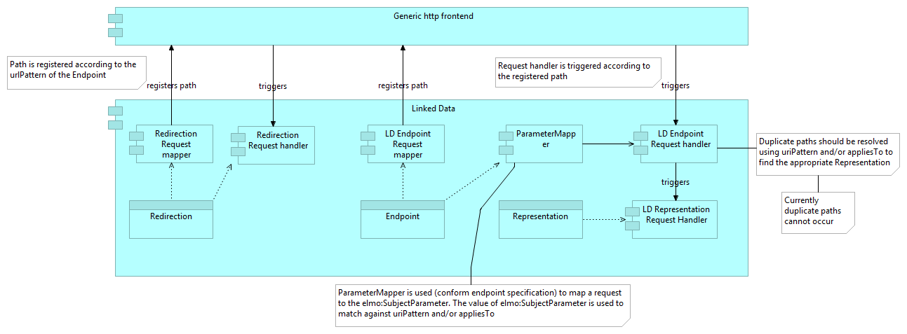
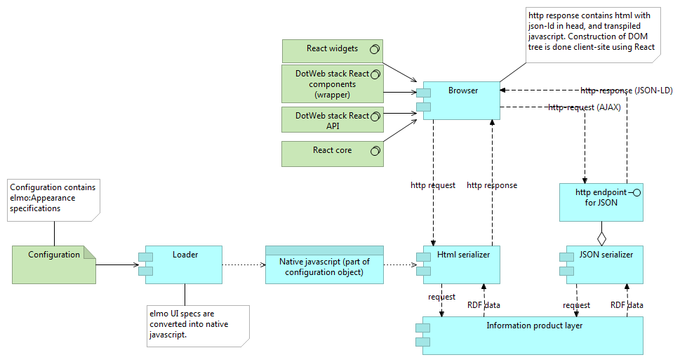

# Linked Data frontend

The Linked Data frontend of the DotWebStack framework conforms to the content negotiation feature of the http protocol, as described in [Cool URIs](http://www.w3.org/TR/cooluris/). The figure below depicts the typical client-server interaction with regard to content negotiation.

Applications that use the DotWebStack framework should at least respond with the correct serialization for JSON, XML, Turtle and HTML. Turtle, JSON-LD or RDF/XML should be returned for a GraphResult information product (CONSTRUCT and DESCRIBE queries), JSON or XML sparql query result should be returned for a TupleResult information product (SELECT and ASK queries).

A http error 415 (Unsupported mediatype) should be returned whenever a mediatype is requested that conflicts with the actual data from the information product (for example: a turtle request for a TupleResult information product, or a sparql query result for a GraphResult).

The JSON, XML and Turtle serializations are directly available from the framework. A html serialization is available from the dotwebstack theatre or dotwebstack theatre legacy projects.

## Design of the LD frontend

The Linked Data frontend consists of two request mappers. These mappers register specific path patterns at the generic http frontend:

- A redirection request mapper, that registers path patterns to be handled by the redirection request handler. The redirection request handler redirections a URL to another URL (according to the 303 strategy as described in [Cool URIs](http://www.w3.org/TR/cooluris/)).
- A linked data endpoint request mapper that registers path patterns to be handled by the linked data endpoint request handler. The linked data endpoint request handler performs all the necessary steps to generate the correct RDF serialization http response. 

## Design of the React UI frontend

The DotWebStack supports the use of React UI frontend components. These React components be used even when the server doesn't use the DotWebStack framework.

A webmaster can add a DotWebStack React component to its website, using the usual method for adding a React component to a website. The original source is transpiled to native javascript, and served from the webserver to the browser of the end-user.

The DotWebStack React API handles the interaction between the browser and any webserver that serves RDF data (JSON-LD or JSON sparql query result). The resulting JSON objects can be used in the React widgets. This can be any already existing React widget, the dotwebstack ReAct wrapper will tranform the JSON objects from the API to the internal data structure of the React widget.

For newly developed widgets, the internal data structure may be equal to the original JSON objects, in such a case transformation is not needed.

By using the DotWebStack server components, it is even possible to create React components that interact with OpenAPI REST services. As is depicted in the figure above, a call from the React component is handled by the generic http frontend, and dispatched to the proper frontend handler as specified in the DotWebStack configuration. The only difference between an OpenAPI REST API and a Linked Data API is the message format: the Linked Data API will use the generic JSON-LD or JSON query result messag format, the OpenAPI REST API will use the message format as specified in the OAS (swagger) specifiation.

React components that use the OpenAPI frontend will be more specific and geared towards a specific business need, react components that use the Linked Data API will be more general and can be used for multiple business needs.

Only React components that use the Linked Data API will use the DotWebStack API, as this component is specifically designed to work with a Linked Data backend, as depicted in the figure below.

## Design of the ReAct html serialization

The dotwebstack theatre contains a html serialization. The html serialization contains the definition of ReAct components, in the same way as an external webserver would place the ReAct components in a html page. The difference will be that the html serialization of the dotwebstack theatre will already be transpiled to native javascript code.

The native javascript code will be generated from the configuration of the LD representations (using appearances), as depicted in the figure below:

