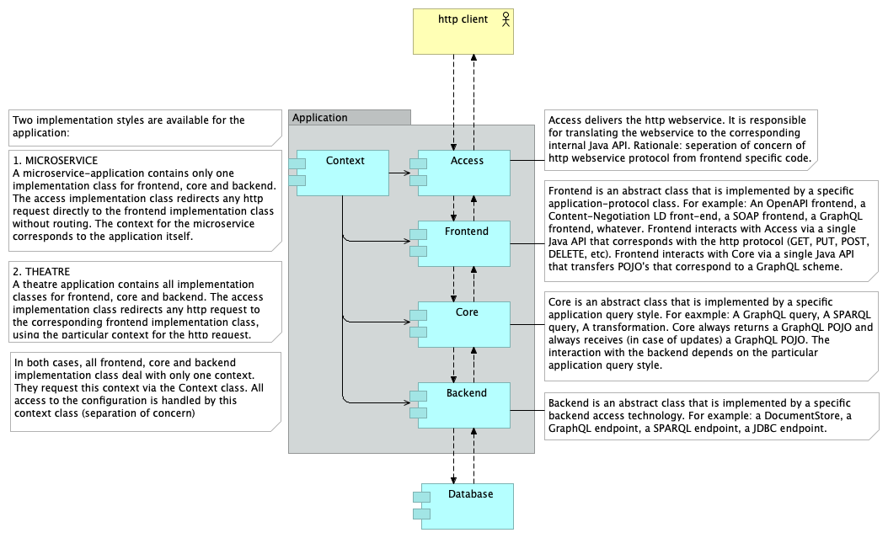
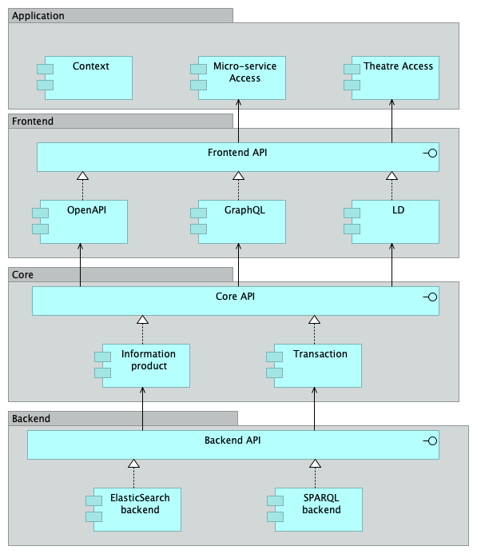
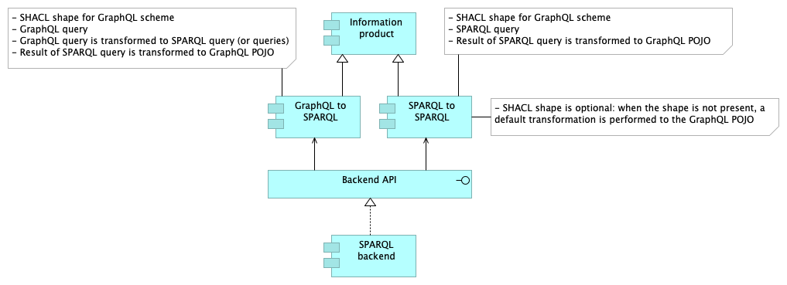

# design

This folder contains the design for the DotWebStack 3.0 architecture:

- DotWebStack 1.0 corresponds to the LDT 1.0 architecture (not yet named dotwebstack);
- DotWebStack 2.0 corresponds to the LDT 2.0 architecture;
- DotWebStack 3.0 is the proposed architecture.

Reasons for the new 3.0 architecture:
1. Enabling the use of micro-services instead of a full-stack application;
2. Enabling the use of non-Linked Data resources.

## Top level architecture

## Details

## Information product Details

