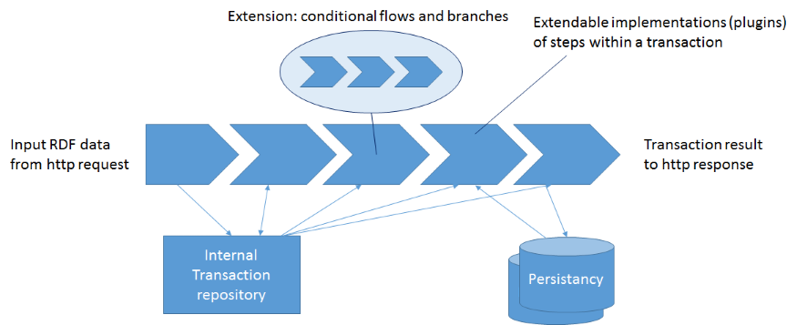

# Transactions

Transactions are used to add data to the backend, and/or manipulate the backend. Input data is expected as RDF triples. Transformation of non-RDF data should be part of the front-end. The properties of a transaction are used to configure the operation flow that is executed when a transaction is requested. Any transaction will execute a flow of transaction steps. A flow can be sequential or parellel. The transaction mechanism is extendable: different kind of steps can be added to the framework, like database operations, external calls or validations. A step can even execute a parallel or sequential subflow.

The transactions start with the storage of the input RDF data into an internal transaction RDF4j repository. This repository is also used for specific steps like the storage of the transaction data and the validation of the transaction data.

At this moment, dotwebstack framework contains four specific steps:

1. A *validation step*, to validate the transaction data agains a SHACL shapes graph;
2. A *assertion step*, to assert that the transaction data conforms to a SPARQL ASK query;
3. An *update step*, to execute SPARUL update statements against a particular backend (this might be the transaction repository, or some other specified backend)
4. A *persistence step*, to store the transaction data into a particular backend and target named graph, using a specified persistence strategy.

The diagram below gives a typical sequential flow.

