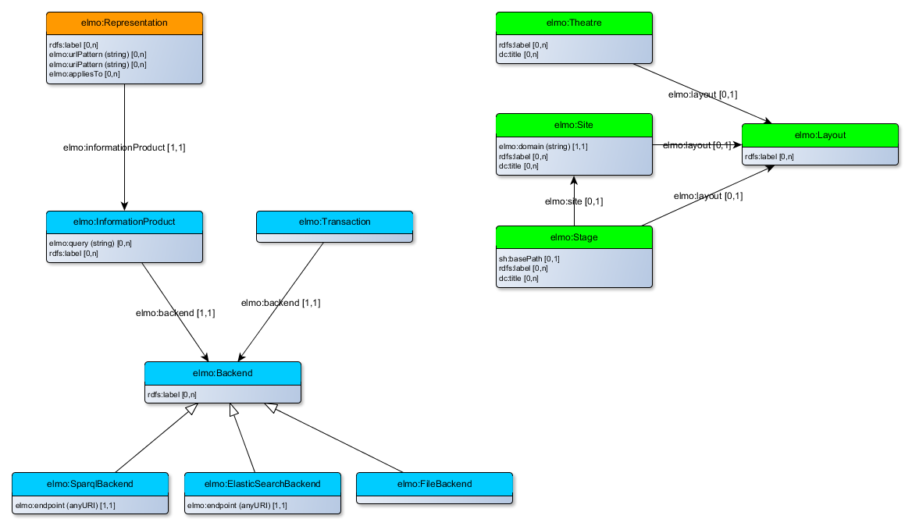

# Extendable Lightweight Model Ontology
A vocabulary for the dotwebstack framework configuration.

Two files contain the specification for the elmo vocabulary:

- elmo2.ttl: the ontology/vocabulary for elmo;
- elmo-shacl.ttl: the shapes that describe which properties are allowed for which classes (using SHACL shapes).

A simple example (example.trig) is also included.

The picture below gives a visual representation of the elmo vocabulary and shapes. The vocabulary consists of three distinct parts:

1. Green: The system configuration (theatre, site, stage and layout);
2. Blue: The core and backend configuration (information product and transaction);
3. Orange: The frontend configuration (representation). 

