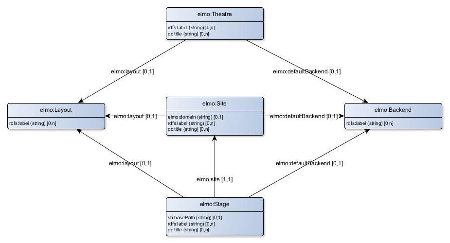
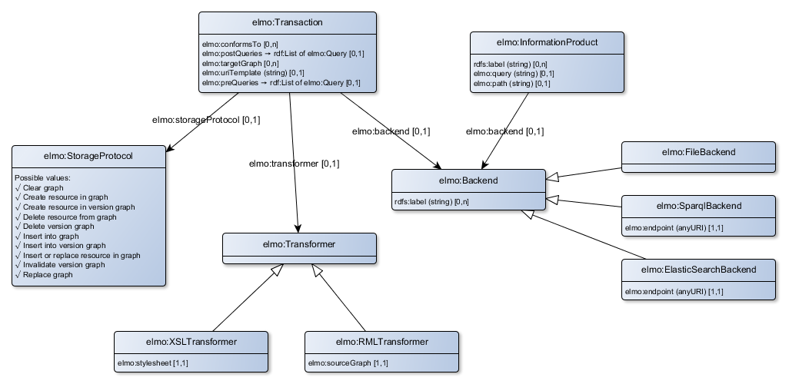
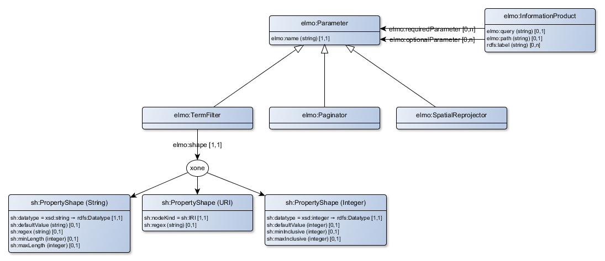
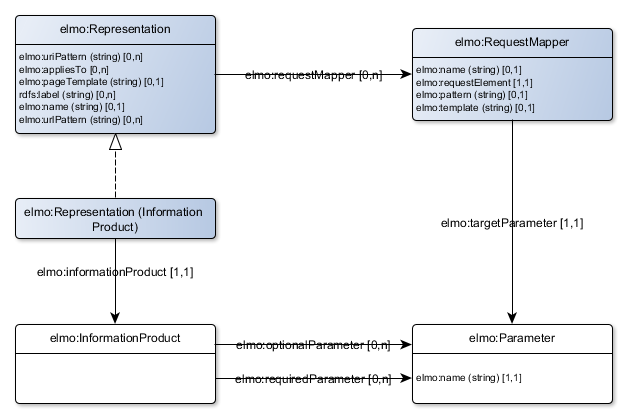
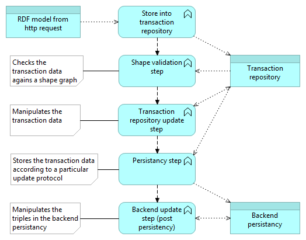
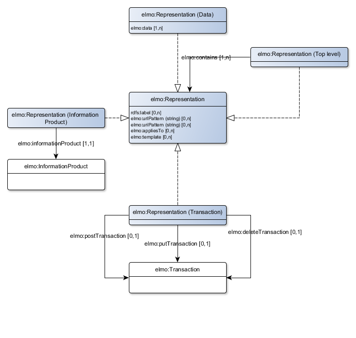

# Extendable Lightweight Model Ontology
A vocabulary for the dotwebstack framework configuration.

Two files contain the specification for the elmo vocabulary:

- elmo2.ttl: the ontology/vocabulary for elmo;
- elmo-shacl.ttl: the shapes that describe which properties are allowed for which classes (using SHACL shapes).

Some example files are also included.

The elmo ontology consists of three seperate parts:

1. The system configuration (theatre, site, stage and layout);
2. The core and backend configuration (information product and transaction)
3. The frontend configuration (representation).

All parts will be discussed in separate chapters.

## System configuration

The picture below gives a visual representation of the elmo vocabulary with respect to the system configuration.

`elmo:Theatre`, `elmo:Site` and `elmo:Stage` are mandatory elements. You may want to specify a UI layout. The value you specify at the stage level will override the value at the site level, which will override the value at the theatre level. You can specify a defaultBackend in the same way. This defaultBackend will be used as a default value for the `elmo:backend` property for an information product or transaction.

We have included a [minimal system configuration](examples/minimal-system-config.trig) as an example how to use these vocabulary elements.

## Core and backend configuration

The picture below gives a visual representation of the elmo vocabulary with respect to the core and backend configuration.

### Information products
`elmo:InformationProduct` is used to retrieve data from a particular back-end. The result should either be a set of RDF triples ('CONSTRUCT'-queries), or a list of bindingsets ('SELECT'-queries). Most important element for an information product is `elmo:query` where you state the query. The format of the query depends on the particular backend.

### Parameters
Both informationproducts and transactions can be parameterized. The diagram below describes how you would specify specific parameters. You can reuse previously defined parameters for multiple information products or transactions.

Three subclasses for parameters exists:

- A `elmo:TermFilter` parameter that can be used to filter the results of an information product by using the value of the parameter as part of the `elmo:query`. You use a shacl shape to specify the constraints on the parameter datatype en values. The type of constraints differ per datatype, as is depicted in the diagram.
- A `elmo:Paginator` parameter than can be used to paginate the results.
- A `elmo:SpatialReprojector` parameter that can be used tot reproject spatial resultdata to a specific crs.

### Request mapping

Parameters in information products get their values by default by a mapping of a query parameter to the parameter of an information product by corresponding names. In some case, you might want to have another name, or you might want to get a value from a different part of the http request, for example the URI itself, or a header value. This is done by use of an `elmo:RequestMapper`.

Request mappers are added to an `elmo:Representation` and are linked to the corresponding parameter via `elmo:targetParameter`. The corresponding http request element is selected via `elmo:requestElement` which uses the [http vocabulary in RDF](http://www.w3.org/TR/HTTP-in-RDF10). Named-value pairs can be selected using the `elmo:name` element. Optionally, you can specify a template to change the value somewhat. The example below gives an example how to use a RequestMapper to map de URI to the subject parameter.

	config:SubjectFromUrl a elmo:RequestMapper;
		elmo:requestElement http:requestURI;
		elmo:pattern "{path}/id/{reference}";
		elmo:template "{path}/doc/{reference}";
		elmo:targetParameter config:Subject;
	.

The syntax for `elmo:pattern` and `elmo:template` conforms to the [JAX-RS Path specification](https://docs.oracle.com/cd/E19798-01/821-1841/ginpw). This means that you can also specify regular expressions as part of the pattern, like: `{path:[a-zA-Z][a-zA-Z_0-9]*}`. 

### Transactions
`elmo:Transaction` is used to add data to the backend, and/or manipulate the backend. When applicable, input data is expected as RDF triples, but transformation of non-RDF data is also supported. The properties of a transaction are used to configure the operation flow that is executed when a transaction is requested. The diagram below gives the typical flow.

Shape validation (as stated with `elmo:conformsTo`) is performed against the data submitted as part of the request. Prequeries are performed against the in-memory dataset. Prequeries are specified as a rdf:List of elmo:Queries. This means that more than one query can be executed in the specified order. The language of the prequeries should be SPARQL Update. PostQueries are performed against the backend persistancy, and are also specified as a rdf:List of elmo:Queries. The language for the postqueries depends on the particular backend that is used.

Via `elmo:storageProtocol` you specify which kind of storage protocol is used to manipulate the persistancy store. The following storage protocols are available:

- `elmo-up:DeleteGraph`: clears the content of the target graph;
- `elmo-up:ReplaceGraph`: replaces the content of the target graph with the content of the transaction dataset;
- `elmo-up:InsertIntoGraph`: inserts the content of the transaction dataset into the target graph, without deleting any triples;
- `elmo-up:InsertOrReplaceResourceInGraph`: inserts the content of the transaction dataset in the target graph, and deletes any triples <s,p,o> for any s that is present in the transaction dataset;
- `elmo-up:DeleteResourceFromGraph`: deletes any triples <s,p,o> from the target graph where s is equal to the value of the subject parameter;
- `elmo-up:CreateResourceInGraph`: mints URIs for any resource in the transaction dataset (as defined by `elmo:uriTemplate`), and inserts the transaction dataset into the target graph;
- `elmo-up:InsertIntoVersionGraph`: inserts the content of the transaction dataset into a newly created versioned target graph.
- `elmo-up:InvalidateVersionGraph`: invalidates the current version (this created a new version that states that the previous version is invalid)
- `elmo-up:DeleteVersionGraph`:  deletes a particular version graph.
- `elmo-up:CreateResourceInVersionGraph`: mints URIs for any resource in the transaction dataset (as defined by `elmo:uriTemplate`), and inserts the content of the transaction dataset into a newly created versioned target graph.

We have created a [configuration file](examples/transactions.trig) that contains some examples how to configure transactions.

## Front-end configuration
The picture below gives a visual representation of the elmo vocabulary with respect to the front-end configuration. You use the front-end configuration to serve regular linked data serializations and HTML. The front-end configuration is not meant for API specifications, for this you will need to create an OpenAPI specification document.

Blank versions of `elmo:InformationProduct` and `elmo:Transaction` are depicted in the picture above, to describe the way that an `elmo:Representation` is linked to these components.

### Redirection
Information resources are dereferenced using an `elmo:Representation`. To redirect the URL of a non-information using the http 303 response, you will use `elmo:Redirection`. The example below redirect all URL's that contain the substring `/id/` to URL's that have this substring replaced by `/doc/`:

	config:NonInformationResourceRedirection a elmo:Redirection;
		elmo:urlPattern "{path}/id/{reference}";
		elmo:redirectTemplate "{path}/doc/{reference}";
	.

The syntax for `elmo:urlPattern` and `elmo:redirectTemplate` are the same as for `elmo:pattern` and `elmo:template` as used with a [RequestMapper](#RequestMapper).

### Representation
To specify which representation is used in a particular situation, you can use the properties `elmo:urlPattern`, `elmo:uriPattern` and `elmo:appliesTo`.

Only top-level representations should have links to transactions. Only the information product from the top-level representation is serialized with the http response (in a RDF format, or as inline data within the HTML). Data from containing representations are only used for html representations.

A representation is linked to a particular appearance that specifies how the data is presented in the browser.

An appearance itself can contain extra properties to configure the appearance. Which properties are applicable depend on the particular type of appearance, for example a `TableAppearance` might contain `elmo:fragment`s that specify the column names:

	config:myRepresentation a elmo:Representation;
		elmo:appearance [
			a elmo:TableAppearance;
			elmo:fragment [
				elmo:appliesTo "g";
				rdfs:label "Graph"@en;
				rdfs:label "Graaf"@nl;
			];
		];
	.

If a representation contains child representations, these child representations will be depicted below each other (except when the appearance explicitly defines otherwise). It is however possible to fully control the way a page is rendered. For this, you might use the property `elmo:template`, that contains a JSX template describing the way appearances are presented on a page.

We have created a [configuration file](examples/jsx-template-representation.trig) that contains some examples how to configure representations with or without JSX templates.
