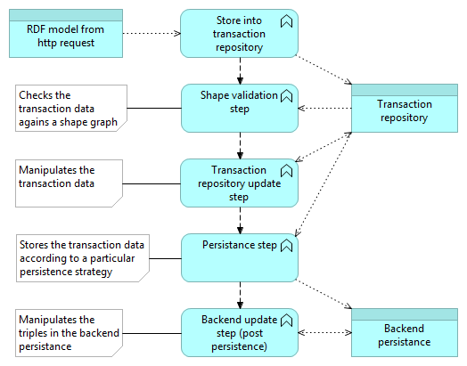
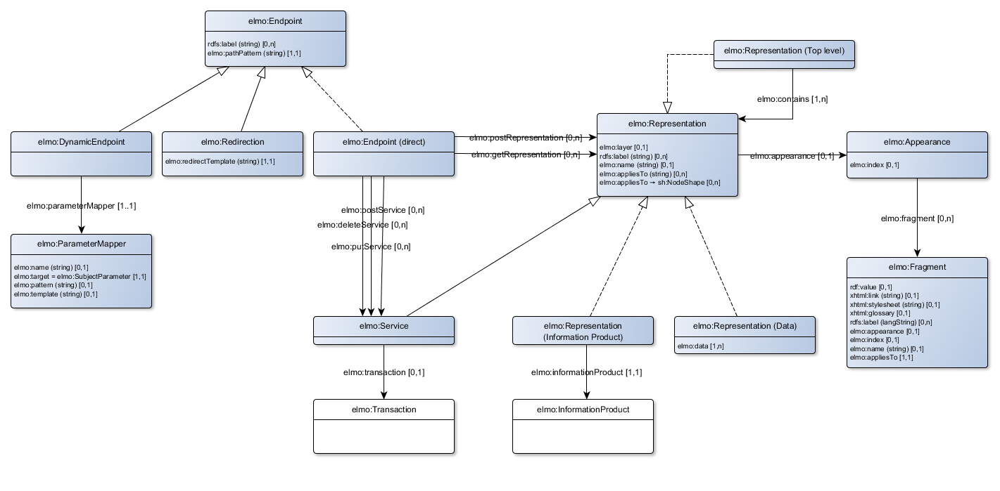
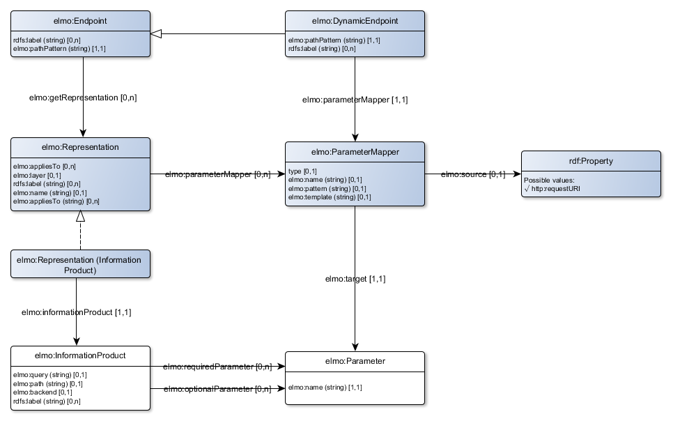

# Extendable Lightweight Model Ontology
A vocabulary for the dotwebstack framework configuration.

Two files contain the specification for the elmo vocabulary:

- elmo2.ttl: the ontology/vocabulary for elmo;
- elmo-shacl.ttl: the shapes that describe which 
- properties are allowed for which classes (using SHACL shapes).

Some example files are also included.

The elmo ontology consists of three seperate parts:

1. The system configuration (theatre, site, stage and layout);
2. The core and backend configuration (information product and transaction)
3. The frontend configuration (representation).

All parts will be discussed in separate chapters.

## System configuration

The picture below gives a visual representation of the elmo vocabulary with respect to the system configuration.

`elmo:Theatre`, `elmo:Site` and `elmo:Stage` are mandatory elements. You may want to specify a UI layout. The value you specify at the stage level will override the value at the site level, which will override the value at the theatre level. You can specify a defaultBackend in the same way. This defaultBackend will be used as a default value for the `elmo:backend` property for an information product or transaction.

We have included a [minimal system configuration](examples/minimal-system-config.trig) as an example how to use these vocabulary elements.

## Core and backend configuration

The picture below gives a visual representation of the elmo vocabulary with respect to the core and backend configuration.

### Information products
`elmo:InformationProduct` is used to retrieve data from a particular back-end. The result should either be a set of RDF triples ('CONSTRUCT'-queries), or a list of bindingsets ('SELECT'-queries). Most important element for an information product is `elmo:query` where you state the query. The format of the query depends on the particular backend.

### Parameters
Both informationproducts and transactions can be parameterized. The diagram below describes how you would specify specific parameters. You can reuse previously defined parameters for multiple information products or transactions.

Three subclasses for parameters exists:

- A `elmo:TermParameter` parameter that can be used to filter the results of an information product by using the value of the parameter as part of the `elmo:query`. You use a shacl shape to specify the constraints on the parameter datatype en values. The type of constraints differ per datatype, as is depicted in the diagram.
- A `elmo:Paginator` parameter than can be used to paginate the results.
- A `elmo:SpatialReprojector` parameter that can be used tot reproject spatial resultdata to a specific crs.

### Transactions
`elmo:Transaction` is used to add data to the backend, and/or manipulate the backend. Input data is expected as RDF triples. Transformation of non-RDF data should be part of the front-end. The properties of a transaction are used to configure the operation flow that is executed when a transaction is requested. Any transaction will execute a flow of transaction steps. A flow can be sequential or parellel. The transaction mechanism is extendable: different kind of steps can be added to the framework, like database operations, external calls or validations. A step can even execute a parallel or sequential subflow.

The transactions start with the storage of the input RDF data into an internal transaction RDF4j repository. This repository can be accessed using the predefined `elmo:TransactionRepository` backend. This repository is also used for specific steps like the storage of the transaction data and the validation of the transaction data.

At this moment, dotwebstack framework contains three specific steps:

1. `elmo:ValidationStep`, to validate the transaction data agains a SHACL shapes graph;
2. `elmo:UpdateStep`, to execute SPARUL update statements against a particular backend (this might be the transaction repository, or some other specified backend)
3. `elmo:PersistenceStep`, to store the transaction data into a particular backend and target named graph, using a specified persistence strategy.

The diagram below gives a typical sequential flow.

Shape validation (as stated with `elmo:conformsTo`) is performed against the data submitted as part of the request. The UpdateStep can be used to change the data in the transaction repository (typically performed before a PersistenceStep) or to change the data in some backend persistancy storage (typically performed after a PersistenceStep).

Via `elmo:persistenceStrategy` you specify which kind of persistence strategy is used to manipulate the persistence store. The following persistence strategies are available:

- `elmo-up:DeleteGraph`: clears the content of the target graph;
- `elmo-up:ReplaceGraph`: replaces the content of the target graph with the content of the transaction dataset;
- `elmo-up:InsertIntoGraph`: inserts the content of the transaction dataset into the target graph, without deleting any triples;
- `elmo-up:InsertOrReplaceResourceInGraph`: inserts the content of the transaction dataset in the target graph, and deletes any triples <s,p,o> for any s that is present in the transaction dataset;
- `elmo-up:DeleteResourceFromGraph`: deletes any triples <s,p,o> from the target graph where s is equal to the value of the subject parameter;
- `elmo-up:CreateResourceInGraph`: mints URIs for any resource in the transaction dataset (as defined by `elmo:uriTemplate`), and inserts the transaction dataset into the target graph;
- `elmo-up:InsertIntoVersionGraph`: inserts the content of the transaction dataset into a newly created versioned target graph.
- `elmo-up:InvalidateVersionGraph`: invalidates the current version (this created a new version that states that the previous version is invalid)
- `elmo-up:DeleteVersionGraph`:  deletes a particular version graph.
- `elmo-up:CreateResourceInVersionGraph`: mints URIs for any resource in the transaction dataset (as defined by `elmo:uriTemplate`), and inserts the content of the transaction dataset into a newly created versioned target graph.

We have created a [configuration file](examples/transactions.trig) that contains some examples how to configure transactions.

## Front-end configuration
The picture below gives a visual representation of the elmo vocabulary with respect to the front-end configuration. You use the front-end configuration to serve regular linked data serializations and HTML. The front-end configuration is not meant for API specifications, for this you will need to create an OpenAPI specification document.

Blank versions of `elmo:InformationProduct` and `elmo:Transaction` are depicted in the picture above, to describe the way that an `elmo:Representation` or `elmo:Service` is linked to these components.

### Parameter mapping

Parameters in information products get their values by default by a mapping of a query parameter to the parameter of an information product by corresponding names. In some case, you might want to have another name, or you might want to get a value from a different part of the http request, for example the URI itself, or a header value. This is done by use of an `elmo:ParameterMapper`.

Parameter mappers are added to `elmo:Representation` and `elmo:Endpoint` with `elmo:parameterMapper`. Those mappers have a link to the corresponding parameter via `elmo:target`. The corresponding http request element is selected via `elmo:source` which uses the [http vocabulary in RDF](http://www.w3.org/TR/HTTP-in-RDF10). Named-value pairs can be selected using the `elmo:name` element. Optionally, you can specify a template to change the value somewhat. The example below gives an example how to use a UriParameterMapper to map de URI to the subject parameter.

	config:SubjectFromUrl a elmo:UriParameterMapper;
		elmo:source http:requestURI;
		elmo:pattern "http://{domain}/{path}/doc/{reference}";
		elmo:template "http://{domain}/{path}/id/{reference}";
		elmo:target elmo:SubjectParameter;
	.

The syntax for `elmo:pattern` and `elmo:template` conforms to the [JAX-RS Path specification](https://docs.oracle.com/cd/E19798-01/821-1841/ginpw). This means that you can also specify regular expressions as part of the pattern, like: `{path:[a-zA-Z][a-zA-Z_0-9]*}`. The default regex pattern for `{path}` will be: `{path:[^/]+?`. 

### Endpoints
Endpoints are used to define which specific path patterns (using `elmo:pathPattern`) can be used to resolve linked data URI's. Three different kinds of endpoints are available:

- Representations.
- (direct) endpoints.
- Dynamic endpoints.

#### Redirection
Information resources are dereferenced using an `elmo:Representation`. To redirect the URL of a non-information using the http 303 response, you will use `elmo:Redirection`. The example below redirect all URL's that contain the substring `/id/` to URL's that have this substring replaced by `/doc/`:

	config:NonInformationResourceRedirection a elmo:Redirection;
		elmo:pathPattern "{path}/id/{reference}";
		elmo:redirectTemplate "{path}/doc/{reference}";
	.

The syntax for `elmo:pathPattern` and `elmo:redirectTemplate` are the same as for `elmo:pattern` and `elmo:template` as used with a [ParameterMapper](#parameter-mapping).

#### Direct endpoints
You use direct endpoints if you are sure that the URI of a resource is located at your server and you know the kind of representation that you want to use. In this case, you specify the representation that is used for a GET to a specific path pattern, as in the example below:

	config:DirectEndpoint a elmo:Endpoint;
		elmo:pathPattern "/query/allitems";
		elmo:getRepresentation elmo:AllItemsRepresentation
	.

A GET http method is the most common method for retrieving a representation. A POST http method is also possible, in which case the parameters are encoding within the body of the http request. In such cases, you use `elmo:postRepresentation` (probably to the same representation).

The POST, PUT and DELETE http methods are used to execute transactions. These methods are used to link an endpoint to one or more services, via `elmo:postService`, `elmo:putService` or `elmo:deleteService`. Services are subclasses of representations and give access to transactions. 

It is possible to combine `elmo:getRepresentation` and `elmo:postService` in the same endpoint. It is also possible that these properties refer to the same service. You can even combine `elmo:postRepresentation` and `elmo:postService` with the same endpoint. In this special case, a http POST request will only be directed via `elmo:postRepresentation` if the value for the http content-type header is equal to `application/x-www-form-urlencoded` or `multipart/form-data`.

#### Dynamic endpoints
Dynamic endpoints are useful when you don't really know what kind of representation should be used for a URI. This can be useful when:

- The URI of the resource you want to represent isn't located at your server (for example: your server is at `http://myserver.org` and you want to represent a URI that starts with `http://notmyserver.org`);
- The URI of the resource you want to represent isn't a http-URI (for example: you want to represent a URI that starts with `urn:uuid`);
- You want to link to some URI, but you are not sure if the URI is located at your server, it might be a URI from the first two categories;
- The representation of the URI cannot be inferred from the URI of the endpoint.

To configure an indirect endpoint, you specify the pathPattern and you specify the way that the value for a special `elmo:SubjectParameter` is mapped. This value will be used by the framework to find out which representation should actually be used:

	config:DynamicEndpoint a elmo:DynamicEndpoint;
		elmo:pathPattern "{path}/doc/{reference}";
		elmo:parameterMapper config:SubjectFromUrl
	.

See the section about parameter mappers to find the specification for `config:SubjectFromUrl`. A representation could be configured as:

	config:Representation a elmo:Representation;
		elmo:appliesTo "/id/concept/{term}";
		elmo:informationProduct ...
	.

This representation will be used whenever the value for the `elmo:SubjectParameter` matches the pattern `/id/concept/{term}`.

#### default endpoint

You can define a default endpoint for each stage. This default endpoint will be used whenever a link is made to a particular resource.

### Representation
Direct endpoints are linked to representations. In such a case, it is clear which representation should be used for a particular endpoint. For dynamic endpoints you need to specify which representation should be used, by using the property `elmo:appliesTo`. This property may contain a URI pattern, or a reference to a sh:NodeShape profile:

- Pattern: the value for `elmo:SubjectParameter` matches the specified pattern;
- Profile: the CBD for `elmo:SubjectParameter` conforms to the specified shape (CBD = Concise Bounded Description, the triples <S,P,O> with S = the value of `elmo:SubjectParameter`.

Only the information product from the top-level representation is serialized with the http response (in a RDF format, or as inline data within the HTML). Data from containing representations are only used for html representations.

A representation is linked to a particular appearance that specifies how the data is presented in the browser.

An appearance itself can contain extra properties to configure the appearance. Which properties are applicable depend on the particular type of appearance, for example a `TableAppearance` might contain `elmo:fragment`s that specify the column names:

	config:myRepresentation a elmo:Representation;
		elmo:appearance [
			a elmo:TableAppearance;
			elmo:fragment [
				elmo:appliesTo "g";
				rdfs:label "Graph"@en;
				rdfs:label "Graaf"@nl;
			];
		];
	.

If a representation contains child representations, these child representations will be depicted below each other (except when the appearance explicitly defines otherwise). It is however possible to fully control the way a page is rendered. For this, you might use the property `elmo:template`, that contains a JSX template describing the way appearances are presented on a page.

We have created a [configuration file](examples/jsx-template-representation.trig) that contains some examples how to configure representations with or without JSX templates.
